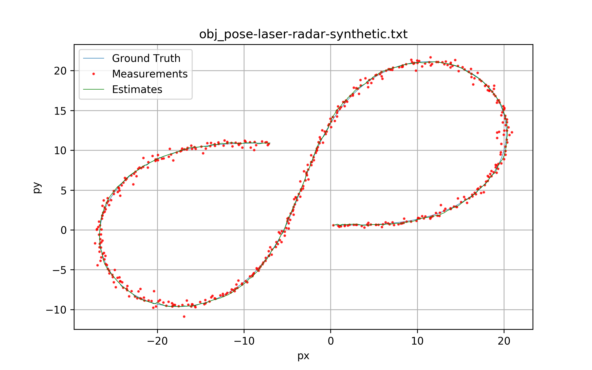
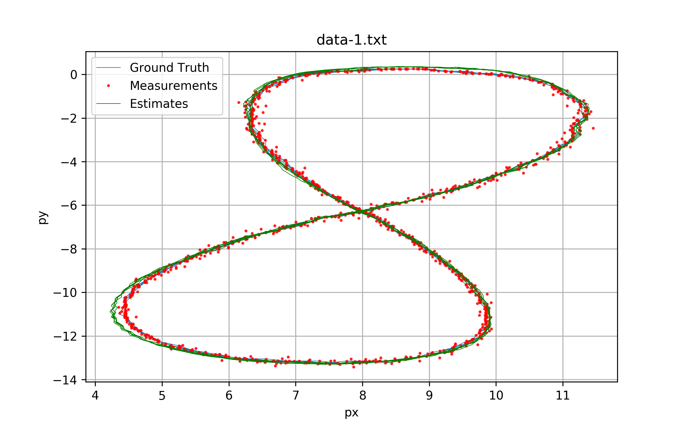
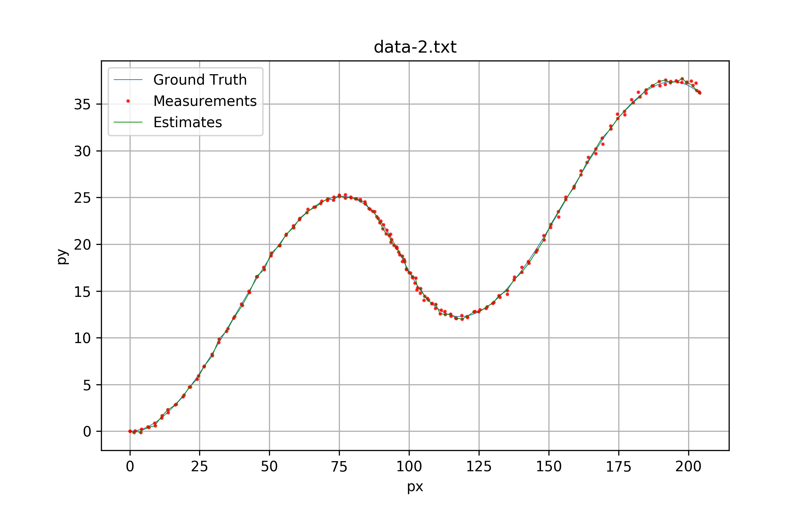

# Extended Kalman Filter Project Starter Code
Self-Driving Car Engineer Nanodegree Program

--- 

The goal of this project is to apply the Extended Kalman Filter to fuse data from LIDAR and Radar sensors. 

## Contents

| Folder/File | Description | 
|:------------|:------------|
| **src**  | source code for the EKF in C++. |
| **data** | input datasets. |
| **data**/obj_pose-laser-radar-synthetic-input.txt | is the new project dataset. The expected RMSE should be less or equal than 0.11, 0.11, 0.52, 0.52.
| **data**/data-1.txt | Datasets for the older version of the project. The expected RMSE for `data-1.txt` should be less or equal than 0.08, 0.08, 0.60, 0.60. |
| **data**/data-2.txt | Another dataset from the older version of the project. |
| **results** | Outputs, logs and visualization images. |
| **results**/visualization.py | Python script to generate the visualizations. |

## Results

### obj_pose-laser-radar-synthetic-input.txt:

*RMSE*: 0.0972256, 0.0853761, 0.450855, 0.439588 <= 0.11, 0.11, 0.52, 0.52.

### data-1.txt:

*RMSE*: 0.0651649, 0.0605378, 0.54319, 0.544191 <=  0.08, 0.08, 0.60, 0.60

### data-2.txt:

*RMSE*: 0.185693, 0.190207, 0.474015, 0.824906

---

## Dependencies

* cmake >= 3.5
 * All OSes: [click here for installation instructions](https://cmake.org/install/)
* make >= 4.1
  * Linux: make is installed by default on most Linux distros
  * Mac: [install Xcode command line tools to get make](https://developer.apple.com/xcode/features/)
  * Windows: [Click here for installation instructions](http://gnuwin32.sourceforge.net/packages/make.htm)
* gcc/g++ >= 5.4
  * Linux: gcc / g++ is installed by default on most Linux distros
  * Mac: same deal as make - [install Xcode command line tools]((https://developer.apple.com/xcode/features/)
  * Windows: recommend using [MinGW](http://www.mingw.org/)

## Basic Build Instructions

1. Clone this repo.
2. Make a build directory: `mkdir build && cd build`
3. Compile: `cmake .. && make` 
   * On windows, you may need to run: `cmake .. -G "Unix Makefiles" && make`
4. Run it: `./ExtendedKF path/to/input.txt path/to/output.txt`. You can find
   some sample inputs in 'data/'.
    - eg. `./ExtendedKF ../data/obj_pose-laser-radar-synthetic-input.txt`

## Editor Settings

We've purposefully kept editor configuration files out of this repo in order to
keep it as simple and environment agnostic as possible. However, we recommend
using the following settings:

* indent using spaces
* set tab width to 2 spaces (keeps the matrices in source code aligned)

## Code Style

Please (do your best to) stick to [Google's C++ style guide](https://google.github.io/styleguide/cppguide.html).

## Generating Additional Data

This is optional!

If you'd like to generate your own radar and lidar data, see the
[utilities repo](https://github.com/udacity/CarND-Mercedes-SF-Utilities) for
Matlab scripts that can generate additional data.

## Project Instructions and Rubric

Note: regardless of the changes you make, your project must be buildable using
cmake and make!

More information is only accessible by people who are already enrolled in Term 2
of CarND. If you are enrolled, see [the project resources page](https://classroom.udacity.com/nanodegrees/nd013/parts/40f38239-66b6-46ec-ae68-03afd8a601c8/modules/0949fca6-b379-42af-a919-ee50aa304e6a/lessons/f758c44c-5e40-4e01-93b5-1a82aa4e044f/concepts/382ebfd6-1d55-4487-84a5-b6a5a4ba1e47)
for instructions and the project rubric.
